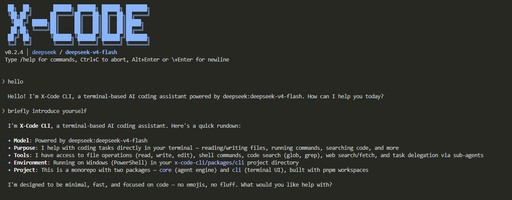

# X-Code CLI

[简体中文](./README.md) · [English](./README.en.md)

**X-Code CLI** is an open-source AI coding agent for your terminal — interact with your codebase using natural language to read, modify, debug, and build projects without leaving the command line.

X-Code CLI supports the major LLM providers (Claude, GPT, DeepSeek, Gemini, Qwen, Grok, GLM, Kimi, etc.), ships with 14 built-in tools (file I/O, shell execution, code search, sub-agent delegation, task tracking, plan mode, etc.), and provides capabilities such as a permission model, context compression, file attachments, a knowledge system, and session resumption.



## Features

- **Multi-model support** — 8 built-in providers and any OpenAI-compatible custom endpoint
- **14 built-in tools** — covers file I/O, shell execution, code search, web fetch, sub-agent delegation, task tracking, plan mode, and other common development tasks
- **Sub-agents (task tool)** — delegate research, code review, planning, and other sub-tasks to specialized sub-agents that run in isolated context and return only conclusions, keeping the main conversation lean. Ships with 4 built-in sub-agents (explore / general-purpose / plan / code-reviewer) and supports custom sub-agents
- **Plan mode** — `--plan` or `/plan` enters a read-only exploration mode where the agent designs a plan first and only executes code changes after user approval
- **Todo tracking** — the agent automatically breaks complex tasks into a todo list and tracks progress
- **3-level permission model** — safe by default, prompts before write operations; `--trust` bypasses prompts
- **Streaming output** — results render as they are generated
- **Context compression** — long conversations are auto-compressed; loop-guard detects repeated tool invocations; prompt caching reuses prefixes to reduce input cost
- **Session resumption** — `--continue` resumes the most recent session; `--resume` opens a session picker or jumps directly by ID
- **Knowledge system** — layered context loading (user-scope AGENTS.md / user-scope auto-memory / project AGENTS.md chain / project auto-memory / project-root `AGENTS.local.md`); subpackage AGENTS.md overrides the repo root. Each directory prefers `AGENTS.md` and falls back to `CLAUDE.md` when absent (Claude Code compat, read-only; `/init` only reads/writes `AGENTS.md`)
- **Auto-memory** — after each turn, durable facts from the conversation (user preferences, corrections, project state, external pointers) are automatically saved and loaded as context next session; `/memory` to inspect entries, edit `auto.md` directly to modify
- **Skills** — describe reusable workflow templates as `SKILL.md` (e.g. code-review checklists, PR-review playbooks); trigger via `/<skill-name>` in the chat; `/skill` manages
- **Custom slash commands** — drop a markdown file into `~/.x-code/commands/<name>.md` (user scope) or `<repo>/.x-code/commands/<name>.md` (project scope) and `/<name>` sends the file body as a prompt to the agent. Supports `$ARGUMENTS` substitution and an optional YAML frontmatter `description`. Precedence is project > plugin > user, and `/plugin refresh` reloads the registry without restart. (Difference from Skills: commands are deterministic prompt templates sent verbatim each invocation, whereas skills are activated by the agent on its own judgement)
- **MCP integration** — first-class Model Context Protocol support (stdio + HTTP with OAuth) via `/mcp`; server tools fold into the agent's tool set
- **Plugin system** — bundle skills / sub-agents / MCP servers / hooks into installable units, with subscribed marketplaces driving discovery. Manifest is byte-compatible with Claude Code's `.claude-plugin/plugin.json`, so its ecosystem installs directly. See [docs/plugins.md](./docs/plugins.md)
- **Hooks** — plugins can register ten lifecycle event callbacks (`SessionStart` / `UserPromptSubmit` / `PreToolUse` / `PostToolUse` / `PreCompact` / `PostCompact` / `SubagentStart` / `SubagentStop` / `TurnComplete` / `SessionEnd`) as shell commands that intercept or rewrite agent behaviour; supports `commandWindows` / `commandDarwin` / `commandLinux` per-platform overrides and a persistent `${pluginDataDir}` variable. See [docs/hooks.md](./docs/hooks.md)
- **File attachments** — `@path` mentions or bare absolute paths in the prompt auto-ingest text / code / PDF / docx / xlsx / pptx / images
- **Vision sub-agent** — text-only providers such as DeepSeek can borrow another configured vision model to generate image descriptions
- **Theme switching** — `/theme` cycles through UI themes, controlling diff colors and syntax-highlight palette
- **Slash commands** — quick controls including `/help`, `/model`, `/thinking`, `/theme`, `/plan`, `/resume`, `/rewind`, `/usage`, `/usage-history`, `/memory`, `/review`, `/doctor`, `/skill`, `/mcp`, `/plugin`, and more
- **Unified thinking-mode toggle** — `/thinking on|off` consolidates each provider's bespoke thinking/reasoning parameters into a single switch
- **Multiline input** — `Alt+Enter` (or `Option+Enter` on macOS) or a trailing `\` followed by Enter inserts a newline; plain Enter still submits
- **Input history recall** — press `↑` / `↓` on an empty prompt to walk through previously submitted messages
- **Cross-platform** — runs on Windows, macOS, and Linux
- **Non-interactive mode** — `--print` with pipes for scripts and CI; `xc plugin <...>` for non-interactive plugin management

## Install

```bash
# Install globally via npm
npm install -g @x-code-cli/cli

# Or with pnpm / yarn
pnpm add -g @x-code-cli/cli
yarn global add @x-code-cli/cli
```

After installation, launch with the `xc` or `x-code` command.

## Configure API Keys

> **Note**: X-Code CLI does not bundle a free model. **At least one provider API key must be configured before use.** Sign up with any provider listed below to obtain a key.
>
> **Recommended: [DeepSeek](https://platform.deepseek.com/)** — affordable, reliable, sufficient coding capability for everyday development, and free credits on signup. A suitable starting point for first-time users.

At least one provider key is required:

| Variable                       | Provider           | Sign up                                                                     |
| ------------------------------ | ------------------ | --------------------------------------------------------------------------- |
| `ANTHROPIC_API_KEY`            | Anthropic (Claude) | [console.anthropic.com](https://console.anthropic.com/)                     |
| `OPENAI_API_KEY`               | OpenAI (GPT)       | [platform.openai.com/api-keys](https://platform.openai.com/api-keys)        |
| `DEEPSEEK_API_KEY`             | DeepSeek           | [platform.deepseek.com/api_keys](https://platform.deepseek.com/api_keys)    |
| `GOOGLE_GENERATIVE_AI_API_KEY` | Google (Gemini)    | [aistudio.google.com/apikey](https://aistudio.google.com/apikey)            |
| `ALIBABA_API_KEY`              | Alibaba (Qwen)     | [dashscope.console.aliyun.com](https://dashscope.console.aliyun.com/apiKey) |
| `XAI_API_KEY`                  | xAI (Grok)         | [console.x.ai](https://console.x.ai/)                                       |
| `ZHIPU_API_KEY`                | Zhipu (GLM)        | [open.bigmodel.cn](https://open.bigmodel.cn/usercenter/apikeys)             |
| `MOONSHOT_API_KEY`             | Moonshot (Kimi)    | [platform.moonshot.ai](https://platform.moonshot.ai/console/api-keys)       |

**OpenAI-compatible escape hatch** (self-hosted vLLM, OpenRouter, internal gateways, etc.): set BOTH `OPENAI_COMPATIBLE_API_KEY` and `OPENAI_COMPATIBLE_BASE_URL`. `xc` then registers a provider named `custom`; address its models as `custom:<your-model-id>`.

### Web Search Keys (optional)

To enable web search (the `web_search` tool), configure **either** of the following. Both providers offer a free tier sufficient for everyday use:

| Variable         | Provider                                      | Free quota                                                          | Signup requirements              |
| ---------------- | --------------------------------------------- | ------------------------------------------------------------------- | -------------------------------- |
| `TAVILY_API_KEY` | [Tavily](https://tavily.com)                  | **1,000 credits / month** (1 credit per basic search, ~1,000/month) | Email signup, **no credit card** |
| `BRAVE_API_KEY`  | [Brave Search](https://brave.com/search/api/) | **$5 free credit / month** ($5 per 1,000 requests, ~1,000/month)    | Credit card required to activate |

> **Tavily is recommended for first-time setup**: simpler signup, with response formats optimized for LLM use (cleaned summaries rather than raw SERP). When both are configured, Tavily is preferred and Brave serves as the automatic fallback.
>
> Quota figures are sourced from official documentation ([Tavily](https://docs.tavily.com/documentation/api-credits), [Brave](https://brave.com/search/api/)); refer to the linked pages for current limits.

**Configuration**

Once the API key is exported as an environment variable, `xc` can be invoked from any directory. The example below uses `ANTHROPIC_API_KEY`; substitute the variable name for the provider in use:

<details>
<summary>bash (Linux / Git Bash / WSL)</summary>

```bash
echo 'export ANTHROPIC_API_KEY=sk-ant-...' >> ~/.bashrc
source ~/.bashrc
```

</details>

<details>
<summary>zsh (macOS default)</summary>

```bash
echo 'export ANTHROPIC_API_KEY=sk-ant-...' >> ~/.zshrc
source ~/.zshrc
```

</details>

<details>
<summary>fish</summary>

```fish
set -Ux ANTHROPIC_API_KEY sk-ant-...
```

</details>

<details>
<summary>Windows PowerShell (user-level, persistent)</summary>

```powershell
[Environment]::SetEnvironmentVariable('ANTHROPIC_API_KEY', 'sk-ant-...', 'User')
# Restart PowerShell to take effect
```

</details>

<details>
<summary>Windows CMD (user-level, persistent)</summary>

```cmd
setx ANTHROPIC_API_KEY "sk-ant-..."
:: Restart CMD to take effect
```

</details>

> For temporary use within a single session, run `export X=...` (bash) or `$env:X = '...'` (PowerShell); these settings are discarded when the terminal closes.
>
> Per-project configuration: place a `.env` file in the project root. `xc` loads it by walking up from the current directory.

## Quick Start

```bash
# Enter the project directory
cd your-project

# Launch an interactive session
xc

# Run with a prompt
xc "Explain the overall architecture of this project"

# Specify a model
xc -m sonnet "Refactor the formatDate function in src/utils.ts"

# Trust mode: skip write-operation confirmations
xc -t

# Plan mode: design a plan first, execute only after approval
xc --plan "Refactor the database connection layer"

# Resume the most recent session
xc -c

# Pick a past session to resume
xc --resume

# Non-interactive mode: print the result and exit, suitable for scripting
xc -p "Generate a CHANGELOG for this repository"
```

## CLI Options

```text
xc [options] [prompt]

--model, -m <id>      Model to use (e.g. sonnet, deepseek, openai:gpt-5.5)
--trust, -t           Trust mode: skip write-operation confirmations
--print, -p           Non-interactive mode: print result and exit
--plan                Start in plan mode (read-only exploration; user must approve before code edits)
--continue, -c        Resume the most recent session in this project (no picker)
--resume, -r [id]     Resume a session: no argument opens the picker; with an ID jumps directly
--max-turns <n>       Cap on agent loop turns per submit (optional; default: unlimited)
--no-plugins          Disable the plugin system entirely (only built-in contributions; useful for triage)
--no-hooks            Plugins still load, but skip all hook execution
--plugin-debug        Mirror plugin / hook / marketplace debug log lines to stderr in real time
--version, -v         Show version
--help, -h            Show help
```

### Non-interactive subcommands

```text
xc plugin <subcommand>            Manage plugins (list / install / uninstall / enable / disable / search / update / info / doctor / marketplace)
xc plugin install [--yes] <src>   Install a plugin; non-TTY defaults to deny, --yes skips confirmation
xc plugin marketplace <sub>       Manage marketplace subscriptions (list / add / remove / refresh / info)
```

Full usage: [docs/plugins.md](./docs/plugins.md).

## Slash Commands

| Command               | Description                                                                                                                    |
| --------------------- | ------------------------------------------------------------------------------------------------------------------------------ |
| `/help`               | Show available commands                                                                                                        |
| `/model [alias]`      | Switch model or list available models                                                                                          |
| `/thinking [on\|off]` | Enable / disable thinking mode (no argument opens the picker)                                                                  |
| `/theme [name]`       | Switch UI theme (no argument opens the picker); controls diff colors and syntax-highlight palette                              |
| `/plan [on\|off]`     | Enable / disable plan mode (no argument toggles the current state)                                                             |
| `/usage`              | Show current-session token usage (including cache hit rate)                                                                    |
| `/usage-history`      | List past project sessions with interactive detail view                                                                        |
| `/clear`              | Clear the current conversation                                                                                                 |
| `/compact`            | Manually compress context                                                                                                      |
| `/resume`             | Pick a past session in this project to resume                                                                                  |
| `/rewind`             | Roll back to before a previous user message — restores agent-edited files and truncates history (no argument opens the picker) |
| `/init`               | Analyze the codebase and create or update `AGENTS.md` at the project root                                                      |
| `/review [PR#]`       | Review a GitHub PR (no argument lists open PRs); requires `gh` to be installed locally                                         |
| `/memory`             | List auto-memory entries (project + user, grouped by category)                                                                 |
| `/skill <sub>`        | Manage Skills (`list` / `install` / `refresh` / `enable` / `disable` / `uninstall`)                                            |
| `/mcp <sub>`          | Manage MCP servers (`list` / `tools` / `add` / `remove` / `auth` / `refresh`, etc.)                                            |
| `/plugin <sub>`       | Manage plugins and marketplaces — see [docs/plugins.md](./docs/plugins.md)                                                     |
| `/doctor`             | Diagnose the runtime environment (version, API keys, MCP connectivity, plugins, sub-agents, skills)                            |
| `/exit`               | Save the session and exit                                                                                                      |

### Thinking-mode notes

The 8 supported providers exhibit different default behaviors for thinking / reasoning mode:

- **Enabled by default**: Gemini 2.5 Pro, Kimi K2.5
- **Disabled by default**: Claude Sonnet, DeepSeek V4, Qwen Max — must be explicitly enabled to reach published benchmark scores
- **Not supported**: GPT-4.1, Grok 3, GLM-4-Plus do not expose a thinking option on the listed model IDs

`/thinking` consolidates these differences into a single switch:

- `/thinking` (no argument): opens an interactive picker showing the current state with arrow-key switching
- `/thinking on`: enables thinking mode for every provider that supports it (slower responses, stronger on hard problems)
- `/thinking off`: disables thinking mode (faster responses, lower cost)

The setting is persisted to `~/.x-code/config.json` and survives restarts. Toggles take effect immediately on the next message; no model rebuild is required.

> **Windows path note**: all `~/.x-code` paths in this document map to `%USERPROFILE%\.x-code` on Windows (typically `C:\Users\<username>\.x-code`).

## File Attachments

Reference a file path in the prompt and the CLI attaches its contents to the request automatically:

```bash
# @ syntax (explicit reference)
> Explain the main function in @D:\code\app\src\main.ts

# Bare absolute paths (extension required)
> Summarize the key points of /home/me/report.pdf

# Images, PDFs, docx, xlsx, and pptx are all supported
> Identify the issue in this screenshot: @D:\screenshots\bug.png
```

Per-provider support:

| Type                 | Claude / GPT / Gemini / Grok / Kimi / Qwen / GLM | DeepSeek               |
| -------------------- | ------------------------------------------------ | ---------------------- |
| Source / text files  | Inlined                                          | Inlined                |
| Text PDF             | Extracted locally (saves tokens)                 | Extracted locally      |
| Scanned PDF          | Native PDF input                                 | Local raster + OCR     |
| docx / xlsx / pptx   | Extracted locally                                | Extracted locally      |
| Images (png/jpg/...) | Native vision                                    | Vision sub-agent / OCR |

**DeepSeek image handling — vision sub-agent**: The DeepSeek API does not support multimodal vision input. When the user attaches an image, the CLI automatically delegates image understanding to another configured provider:

1. Checks whether any other multimodal provider key is configured in the environment (priority: Google → Zhipu → Alibaba → OpenAI → Anthropic → Moonshot → xAI)
2. If found, invokes a lightweight vision model from that provider (e.g. `gemini-2.5-flash` or `glm-4v-flash`) to generate an image description
3. Injects the description text into the message sent to DeepSeek so the image content remains accessible
4. The terminal prints `⎿  Captioned image via google:gemini-2.5-flash` to indicate which sub-agent was used
5. If no vision provider is configured, the CLI falls back to local `tesseract.js` OCR (text-in-image only)

**Recommendation** for DeepSeek users: register a free vision model key for richer image understanding:

- **Google Gemini** (`GOOGLE_GENERATIVE_AI_API_KEY`): free tier of approximately 10 RPM / 250 RPD on Gemini 2.5 Flash (refer to the [official rate-limits page](https://ai.google.dev/gemini-api/docs/rate-limits) for current quotas). Provides the highest description quality; access from some regions requires a VPN. Create a key at [aistudio.google.com/apikey](https://aistudio.google.com/apikey) by signing in with a Google account.
- **Zhipu GLM-4V-Flash** (`ZHIPU_API_KEY`): officially marked permanently free, sufficient for personal use, directly accessible from China. Register at [open.bigmodel.cn](https://open.bigmodel.cn/usercenter/apikeys) and create a key from the user center.

**Limitations of the vision sub-agent**:

- The sub-agent returns a text description rather than supporting true multimodal interaction; DeepSeek cannot ask follow-up questions about the image (e.g. "what color is the button in the top-right corner" cannot be answered)
- For complex UI reproduction or pixel-level layout review, the text description may omit fine details
- For such scenarios, switch to a multimodal model (Claude, Gemini, GLM-4V, etc.) via `/model` and continue the conversation directly

## Detailed Usage Docs

This README is the entry view. Each feature has a focused doc under [`docs/`](./docs/) (bilingual — Chinese as `*.md`, English as `*.en.md`):

| Doc                                                            | What it covers                                                                                            |
| -------------------------------------------------------------- | --------------------------------------------------------------------------------------------------------- |
| [`docs/skills.en.md`](./docs/skills.en.md)                     | Write reusable workflow templates, trigger with `/<name>`                                                 |
| [`docs/sub-agents.en.md`](./docs/sub-agents.en.md)             | Use built-in / custom sub-agents via the `task` tool                                                      |
| [`docs/mcp.en.md`](./docs/mcp.en.md)                           | Configure MCP servers (stdio / HTTP / OAuth) + `/mcp` commands                                            |
| [`docs/knowledge.en.md`](./docs/knowledge.en.md)               | Knowledge base (`AGENTS.md` / `CLAUDE.md` 5-layer load) and auto-memory                                   |
| [`docs/plugins.en.md`](./docs/plugins.en.md)                   | Install / manage plugins, `/plugin` slash commands, `xc plugin` non-interactive form                      |
| [`docs/marketplace.en.md`](./docs/marketplace.en.md)           | Subscribe to / self-host a plugin marketplace                                                             |
| [`docs/hooks.en.md`](./docs/hooks.en.md)                       | Plugins hook into 10 agent lifecycle events (decision protocol, cross-platform commands, worked examples) |
| [`docs/plugin-authoring.en.md`](./docs/plugin-authoring.en.md) | Write your own plugin (full manifest schema, layout conventions, iteration loop)                          |

**Claude Code compatibility**: the plugin loader recognises both `.x-code-plugin/plugin.json` and `.claude-plugin/plugin.json`, so plugins authored for Claude Code / Codex install directly; the MCP config schema is identical to Claude Code's. First-run automatically subscribes to `anthropic-marketplace`.

## Troubleshooting

To capture a debug log, set `DEBUG_STDOUT=1` in the current session and launch. Shell syntax varies — pick the one that matches your shell:

**bash / zsh / Git Bash**

```bash
DEBUG_STDOUT=1 xc
```

**fish**

```fish
env DEBUG_STDOUT=1 xc
```

**Windows PowerShell**

```powershell
$env:DEBUG_STDOUT=1; xc
```

**Windows CMD**

```cmd
set DEBUG_STDOUT=1 && xc
```

> All forms above are session-scoped — the variable is set only for the current invocation and discarded when the terminal closes. To persist across launches, follow the persistent setup in the "Configuration" section above.

The log is written under the user directory:

- **Path**: `~/.x-code/logs/debug.log` (with rotated `debug.log.1`; on Windows: `%USERPROFILE%\.x-code\logs\debug.log`)
- **Size limit**: 10 MB per file, ~20 MB total including the rotated backup; the oldest data is overwritten automatically
- **Capacity reference**: a typical 50-turn agent session produces ~5 MB of log, which fits entirely within the active file; rotation only occurs after ~100 turns
- **Per-entry limit**: each entry is capped at 1 KB (truncated with a marker if longer), guaranteeing at least 20,000 entries per rotation cycle
- **Inspection**: `tail -f ~/.x-code/logs/debug.log` (Windows PowerShell: `Get-Content -Wait ~\.x-code\logs\debug.log`), or attach the file to a GitHub Issue

The log file is written only when `DEBUG_STDOUT=1` is set; default runs incur zero overhead.

## Companion Book

If you want to understand X-Code CLI's internals (not just use it), I wrote a companion tutorial on Juejin: [**《从零打造一个 AI Agent CLI》 (Build an AI Agent CLI from Scratch)**](https://juejin.cn/book/7639017024882278440?suid=1433418893103645&source=h5). It walks through this repository chapter by chapter:

- The full agent-loop implementation (streaming, tool use, context compression, loop-guard)
- Multi-provider abstraction and prompt-cache adaptation across vendors
- Terminal UI rendering (why we bypass Ink's log-update; how cell-grid diffing fixes CJK/IME jitter)
- Engineering tradeoffs behind permissions, sub-agents, plan mode, and other production-grade features

> The tutorial is written in Chinese, intended for developers who want to build their own CLI tool or contributors who want to read this repository's source in depth.

## Build From Source

```bash
# Clone the repository
git clone https://github.com/woai3c/x-code-cli.git
cd x-code-cli

# Install dependencies
pnpm install

# Run
pnpm dev
```

> Source changes require rerunning `pnpm build` or `pnpm dev` to take effect. To watch for changes, run `pnpm dev` inside `packages/core` in a separate terminal (which executes `tsc -b --watch`).

## Feedback & Contributing

Issues and pull requests are welcome: <https://github.com/woai3c/x-code-cli>

## License

[MIT](./LICENSE)
