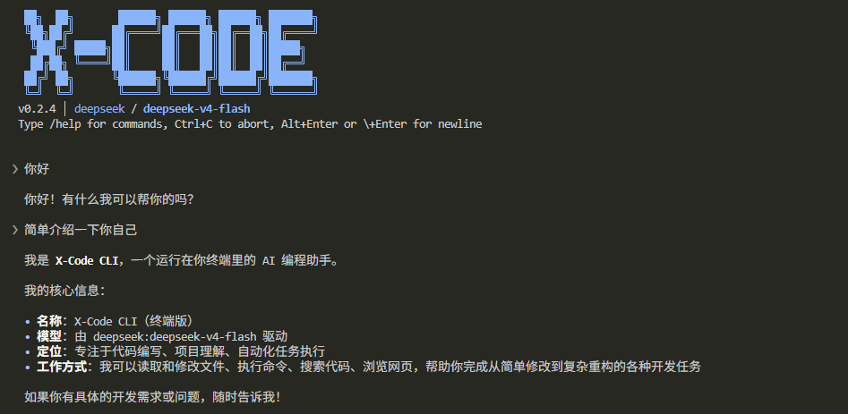

# X-Code CLI

[简体中文](./README.md) · [English](./README.en.md)

**X-Code CLI** 是一个运行在终端的开源 AI 编程助手——通过自然语言与代码库交互，完成阅读、修改、调试和构建等开发任务，无需离开命令行。

X-Code CLI 支持主流大模型（Claude、GPT、DeepSeek、Gemini、Qwen、Grok、GLM、Kimi 等），内置 14 个工具（文件读写、Shell 执行、代码搜索、子 Agent 委派、任务追踪、计划模式等），并提供权限控制、上下文压缩、文件附件、知识库、会话恢复等能力。



## 功能特性

- **多模型支持**：内置 8 家主流厂商，并支持任意 OpenAI 兼容接口
- **14 个内置工具**：覆盖文件读写、Shell 执行、代码搜索、网页抓取、子 Agent 委派、任务追踪、计划模式等常见开发场景
- **子 Agent（task 工具）**：将研究、代码审查、规划等子任务委派给专用子 Agent，独立上下文运行后仅返回结论，保持主对话简洁。内置 4 个子 Agent（explore / general-purpose / plan / code-reviewer），支持自定义子 Agent
- **Plan 模式**：`--plan` 或 `/plan` 进入只读探索模式，Agent 先制定方案、经用户批准后再执行代码修改
- **Todo 追踪**：Agent 自动将复杂任务分解为 todo 列表并追踪执行进度
- **三级权限模型**：默认安全，写操作前请求确认；`--trust` 可跳过确认
- **流式输出**：边生成边显示，无需等待完整响应
- **上下文压缩**：长对话自动压缩历史；loop-guard 检测循环调用；prompt cache 复用前缀降低重复输入成本
- **会话恢复**：`--continue` 恢复最近一次会话；`--resume` 打开历史会话选择器或按 ID 直达
- **知识库系统**：分层加载（用户级 AGENTS.md / 用户级自动记忆 / 项目 AGENTS.md chain / 项目自动记忆 / 项目根 `AGENTS.local.md`），项目子包可覆盖根级约定；每个目录优先读 `AGENTS.md`，缺失时回退到 `CLAUDE.md`（Claude Code 兼容,只读不写,`/init` 只读写 `AGENTS.md`）
- **自动记忆**：每轮对话结束后自动从最近转录里筛选值得长期记住的事实(用户偏好、纠正反馈、项目状态、外部资源指针),下次会话作为上下文加载;`/memory` 查看当前条目,直接编辑 `auto.md` 修改
- **Skills**：以 `SKILL.md` 描述可复用工作流模板（如代码审查清单、PR 评审范式），交互中通过 `/<skill-name>` 触发；`/skill` 管理
- **自定义斜杠命令**：把 markdown 文件放进 `~/.x-code/commands/<name>.md`（用户级）或 `<repo>/.x-code/commands/<name>.md`（项目级），输入 `/<name>` 即把文件内容作为 prompt 发给 agent；支持 `$ARGUMENTS` 占位符与可选的 YAML frontmatter `description`；优先级为 project > plugin > user，`/plugin refresh` 后即时生效（与 Skills 的区别：commands 是确定性模板每次都发同一段，skills 由 agent 按场景自主激活）
- **MCP 集成**：支持 Model Context Protocol 服务器（stdio + HTTP，含 OAuth），由 `/mcp` 管理；服务器工具自动并入 agent 工具集
- **插件系统**：将 skill / sub-agent / MCP 服务器 / hooks 打包成可分发单元，统一安装/启用/卸载；订阅 marketplace 一键发现插件；Manifest 与 Claude Code 字节级兼容，可直接安装其生态的插件。详见 [docs/plugins.md](./docs/plugins.md)
- **Hooks**：插件可注册 10 个生命周期事件回调（`SessionStart` / `UserPromptSubmit` / `PreToolUse` / `PostToolUse` / `PreCompact` / `PostCompact` / `SubagentStart` / `SubagentStop` / `TurnComplete` / `SessionEnd`），用 shell 命令拦截/改写 agent 行为；支持 `commandWindows` / `commandDarwin` / `commandLinux` 跨平台命令覆盖、`${pluginDataDir}` 持久数据目录。详见 [docs/hooks.md](./docs/hooks.md)
- **文件附件**：在提示词中以 `@path` 或裸绝对路径引用文件，自动识别 text / code / PDF / docx / xlsx / pptx / 图片
- **视觉子 agent**：DeepSeek 等纯文本模型可借用其他多模态厂商生成图片描述
- **主题切换**：`/theme` 切换 UI 主题，控制 diff 配色和语法高亮风格
- **斜杠命令**：`/help`、`/model`、`/thinking`、`/theme`、`/plan`、`/resume`、`/rewind`、`/usage`、`/usage-history`、`/memory`、`/review`、`/doctor`、`/skill`、`/mcp`、`/plugin` 等
- **统一思考模式开关**：`/thinking on|off` 将不同厂商各异的 thinking/reasoning 参数统一为单一开关
- **多行输入**：`Alt+Enter`（macOS 为 `Option+Enter`）或行尾 `\` 后 Enter 插入换行；普通 Enter 直接发送
- **历史输入回溯**：输入框为空时按 `↑`/`↓` 召回已提交的提示词
- **跨平台**：支持 Windows、macOS、Linux
- **非交互模式**：`--print` 配合管道输入，可嵌入脚本与 CI；`xc plugin <...>` 非交互管理插件

## 安装

```bash
# 通过 npm 全局安装
npm install -g @x-code-cli/cli

# 或使用 pnpm / yarn
pnpm add -g @x-code-cli/cli
yarn global add @x-code-cli/cli
```

安装完成后，使用 `xc` 或 `x-code` 命令启动。

## 配置 API Key

> **说明**：X-Code CLI 不内置任何免费模型，**必须配置至少一个厂商的 API Key 后方可使用**。请前往下方任一厂商注册并获取 API Key。
>
> **推荐 [DeepSeek](https://platform.deepseek.com/)**：价格低廉、国内访问稳定、代码能力满足日常开发需求，注册赠送初始额度，适合首次试用。

至少配置一个厂商的 API Key 即可使用：

| 环境变量                       | 厂商                | 注册地址                                                                    |
| ------------------------------ | ------------------- | --------------------------------------------------------------------------- |
| `ANTHROPIC_API_KEY`            | Anthropic（Claude） | [console.anthropic.com](https://console.anthropic.com/)                     |
| `OPENAI_API_KEY`               | OpenAI（GPT）       | [platform.openai.com/api-keys](https://platform.openai.com/api-keys)        |
| `DEEPSEEK_API_KEY`             | DeepSeek            | [platform.deepseek.com/api_keys](https://platform.deepseek.com/api_keys)    |
| `GOOGLE_GENERATIVE_AI_API_KEY` | Google（Gemini）    | [aistudio.google.com/apikey](https://aistudio.google.com/apikey)            |
| `ALIBABA_API_KEY`              | 阿里通义（Qwen）    | [dashscope.console.aliyun.com](https://dashscope.console.aliyun.com/apiKey) |
| `XAI_API_KEY`                  | xAI（Grok）         | [console.x.ai](https://console.x.ai/)                                       |
| `ZHIPU_API_KEY`                | 智谱（GLM）         | [open.bigmodel.cn](https://open.bigmodel.cn/usercenter/apikeys)             |
| `MOONSHOT_API_KEY`             | Moonshot（Kimi）    | [platform.moonshot.ai](https://platform.moonshot.ai/console/api-keys)       |

**OpenAI 兼容接入**（自托管 vLLM / OpenRouter / 各种代理 / 公司内网网关等）：同时设置 `OPENAI_COMPATIBLE_API_KEY` 与 `OPENAI_COMPATIBLE_BASE_URL`，xc 会注册一个名为 `custom` 的 provider，模型 id 写成 `custom:<your-model-id>` 使用。

### 网页搜索 Key（可选）

启用网页搜索（`web_search` 工具）需要从下表中**任选一项**配置。两家服务均提供免费额度：

| 环境变量         | 提供方                                        | 免费额度                                                          | 注册门槛                 |
| ---------------- | --------------------------------------------- | ----------------------------------------------------------------- | ------------------------ |
| `TAVILY_API_KEY` | [Tavily](https://tavily.com)                  | **每月 1,000 credits**（基础搜索 1 credit / 次，约 1,000 次/月）  | 邮箱注册，**无需信用卡** |
| `BRAVE_API_KEY`  | [Brave Search](https://brave.com/search/api/) | **每月 $5 免费额度**（Search 端点 $5 / 1,000 次，约 1,000 次/月） | 需绑定信用卡才能开通     |

> **推荐首次配置 Tavily**：注册流程简便，返回格式针对 LLM 场景优化（提供清洗后的摘要而非原始 SERP）。同时配置时优先使用 Tavily，未配置时自动回退至 Brave。
>
> 上述额度数据来源于官方文档（[Tavily](https://docs.tavily.com/documentation/api-credits)、[Brave](https://brave.com/search/api/)），实际配额以官方页面为准。

**配置方式**

将 API Key 设置为环境变量后，`xc` 可在任意目录下直接调用。以下示例使用 `ANTHROPIC_API_KEY`，请替换为实际使用的厂商变量名：

<details>
<summary>bash（Linux / Git Bash / WSL）</summary>

```bash
echo 'export ANTHROPIC_API_KEY=sk-ant-...' >> ~/.bashrc
source ~/.bashrc
```

</details>

<details>
<summary>zsh（macOS 默认）</summary>

```bash
echo 'export ANTHROPIC_API_KEY=sk-ant-...' >> ~/.zshrc
source ~/.zshrc
```

</details>

<details>
<summary>fish</summary>

```fish
set -Ux ANTHROPIC_API_KEY sk-ant-...
```

</details>

<details>
<summary>Windows PowerShell（用户级，永久生效）</summary>

```powershell
[Environment]::SetEnvironmentVariable('ANTHROPIC_API_KEY', 'sk-ant-...', 'User')
# 重启 PowerShell 后生效
```

</details>

<details>
<summary>Windows CMD（用户级，永久生效）</summary>

```cmd
setx ANTHROPIC_API_KEY "sk-ant-..."
:: 重启 CMD 后生效
```

</details>

> 如需临时使用，可在当前会话执行 `export X=...`（bash）或 `$env:X = '...'`（PowerShell），终端关闭后失效。
>
> 项目级配置：在项目根目录放置 `.env` 文件，`xc` 会从当前目录向上逐层加载。

## 快速上手

```bash
# 进入项目目录
cd your-project

# 启动交互式会话
xc

# 直接附带提示词运行
xc "解释项目的整体架构"

# 指定模型
xc -m sonnet "重构 src/utils.ts 中的 formatDate 函数"

# 信任模式：跳过写操作确认
xc -t

# Plan 模式：先制定方案，经批准后再修改代码
xc --plan "重构数据库连接层"

# 恢复最近一次会话
xc -c

# 从历史会话中选择恢复
xc --resume

# 非交互模式：输出结果后退出，适用于脚本调用
xc -p "为该仓库生成 CHANGELOG"
```

## 命令行参数

```text
xc [options] [prompt]

--model, -m <id>      指定模型（如 sonnet、deepseek、openai:gpt-5.5）
--trust, -t           信任模式：跳过写操作确认
--print, -p           非交互模式：输出结果后退出
--plan                以 Plan 模式启动（只读探索，用户批准后才执行修改）
--continue, -c        恢复当前项目最近一次会话（无选择器）
--resume, -r [id]     恢复会话：无参数打开选择器，指定 ID 直达
--max-turns <n>       Agent 循环每次提交的轮次上限（可选，默认无上限）
--no-plugins          禁用插件系统（仅加载内置贡献，用于排障）
--no-hooks            插件正常加载，但跳过所有 hook 执行
--plugin-debug        把 plugin / hook / marketplace 调试日志实时镜像到 stderr
--version, -v         显示版本号
--help, -h            显示帮助信息
```

### 非交互子命令

```text
xc plugin <subcommand>            管理插件（list / install / uninstall / enable / disable / search / update / info / doctor / marketplace）
xc plugin install [--yes] <src>   安装插件；非 TTY 默认拒绝，--yes 跳过确认
xc plugin marketplace <sub>       管理插件市场订阅（list / add / remove / refresh / info）
```

完整用法见 [docs/plugins.md](./docs/plugins.md)。

## 斜杠命令

| 命令                  | 说明                                                                                |
| --------------------- | ----------------------------------------------------------------------------------- |
| `/help`               | 查看所有可用命令                                                                    |
| `/model [alias]`      | 切换模型或查看可用模型列表                                                          |
| `/thinking [on\|off]` | 启用 / 禁用思考模式（无参数时弹出选择器）                                           |
| `/theme [name]`       | 切换 UI 主题（无参数时弹出选择器），控制 diff 配色和语法高亮                        |
| `/plan [on\|off]`     | 启用 / 禁用 Plan 模式（无参数时切换当前状态）                                       |
| `/usage`              | 查看本次会话 Token 用量（含缓存命中率）                                             |
| `/usage-history`      | 列出当前项目历史会话，可交互选择查看详情                                            |
| `/clear`              | 清空当前会话                                                                        |
| `/compact`            | 手动压缩上下文                                                                      |
| `/resume`             | 从当前项目的历史会话中选择一个恢复                                                  |
| `/rewind`             | 回到本会话某条用户消息之前——同时还原 agent 改过的文件并截断对话历史（无参弹选择器） |
| `/init`               | 分析代码库后在项目根创建或更新 `AGENTS.md`                                          |
| `/review [PR号]`      | 评审 GitHub PR（无参数列出开放 PR；需本地装好 `gh`）                                |
| `/memory`             | 查看当前自动记忆条目（project + user,按类目分组）                                   |
| `/skill <sub>`        | 管理 Skills（`list` / `install` / `refresh` / `enable` / `disable` / `uninstall`）  |
| `/mcp <sub>`          | 管理 MCP 服务器（`list` / `tools` / `add` / `remove` / `auth` / `refresh` 等）      |
| `/plugin <sub>`       | 管理插件与 marketplace（详见 [docs/plugins.md](./docs/plugins.md)）                 |
| `/doctor`             | 一键诊断运行环境（版本、API Key、MCP 连通性、插件、子 Agent、Skills）               |
| `/exit`               | 保存会话并退出                                                                      |

### 思考模式说明

X-Code CLI 支持的 8 家厂商对思考 / 推理模式的默认行为存在差异：

- **默认开启**：Gemini 2.5 Pro、Kimi K2.5
- **默认关闭**：Claude Sonnet、DeepSeek V4、Qwen Max（需显式开启以达到官方基准成绩）
- **不支持**：GPT-4.1、Grok 3、GLM-4-Plus 在所列模型 ID 下无对应特性

`/thinking` 命令将上述差异统一为单一开关：

- `/thinking`（无参数）：弹出交互式选择器，显示当前状态并支持方向键切换
- `/thinking on`：对所有支持该特性的模型启用思考模式（响应较慢，复杂问题表现更佳）
- `/thinking off`：对所有支持该特性的模型禁用思考模式（响应更快，成本更低）

配置持久化保存至 `~/.x-code/config.json`，重启后仍然生效；切换立即生效，自下一条消息起使用新模式。

> **Windows 路径说明**：文档中所有 `~/.x-code` 路径在 Windows 上对应 `%USERPROFILE%\.x-code`（通常为 `C:\Users\<用户名>\.x-code`）。

## 文件附件

在提示词中引用文件路径，CLI 会自动将文件内容附加至请求中：

```bash
# @ 语法（显式附加）
> 解释 @D:\code\app\src\main.ts 中的 main 函数

# 裸绝对路径（需带扩展名）
> 总结 /home/me/report.pdf 的核心内容

# 支持图片、PDF、docx、xlsx、pptx 等格式
> 分析此截图中的异常：@D:\screenshots\bug.png
```

各模型支持情况：

| 类型               | Claude / GPT / Gemini / Grok / Kimi / Qwen / GLM | DeepSeek                |
| ------------------ | ------------------------------------------------ | ----------------------- |
| 文本 / 代码文件    | 直接内联                                         | 直接内联                |
| 文本型 PDF         | 本地抽取文本（节省 token）                       | 本地抽取文本            |
| 扫描型 PDF         | 作为 PDF 原生识别                                | 本地栅格化 + OCR        |
| docx / xlsx / pptx | 本地抽取文本                                     | 本地抽取文本            |
| 图片（png/jpg 等） | 多模态原生识别                                   | 视觉辅助模型 / OCR 兜底 |

**DeepSeek 图片识别 — 视觉辅助模型**：DeepSeek 官方 API 不支持多模态视觉输入。当用户附加图片时，CLI 按以下流程自动调用其他厂商的视觉模型生成描述：

1. 检测环境变量中是否配置了其他多模态厂商的 API Key（优先级顺序：Google → 智谱 → 阿里 → OpenAI → Anthropic → Moonshot → xAI）
2. 若已配置，则使用对应厂商的轻量视觉模型（如 `gemini-2.5-flash`、`glm-4v-flash`）生成图片描述
3. 将描述文本注入至发送给 DeepSeek 的消息中，使其能够获取图片信息
4. 终端输出 `⎿  Captioned image via google:gemini-2.5-flash` 标识所使用的辅助模型
5. 若未配置任何视觉厂商，则回退至本地 tesseract OCR（仅提取图片中的文本）

**建议** DeepSeek 用户额外注册一个免费视觉模型 Key，以获得更完整的图像理解能力：

- **Google Gemini**（`GOOGLE_GENERATIVE_AI_API_KEY`）：免费额度约 10 RPM / 250 RPD（实际配额以 [官方文档](https://ai.google.dev/gemini-api/docs/rate-limits) 为准），识别质量最佳，国内访问需代理。在 [aistudio.google.com/apikey](https://aistudio.google.com/apikey) 使用 Google 账号即可创建 Key
- **智谱 GLM-4V-Flash**（`ZHIPU_API_KEY`）：官方标注永久免费，满足个人日常使用，国内可直连。在 [open.bigmodel.cn](https://open.bigmodel.cn/usercenter/apikeys) 注册账号后创建 Key

**视觉辅助模型的能力边界**：

- 辅助模型仅返回**文字描述**，并非真正的多模态对话；DeepSeek 无法基于图片进行追问（例如询问"左上角按钮的颜色"无法识别）
- 复杂 UI 还原、像素级布局校验等场景下，文字描述可能丢失细节
- 此类场景建议通过 `/model` 切换至 Claude、Gemini、GLM-4V 等多模态模型直接处理

## 详细使用文档

README 是入门视图，每个功能的完整用法在 [`docs/`](./docs/) 下（中英对照，中文为 `*.md`，英文为 `*.en.md`）：

| 文档                                                     | 你想做什么                                                          |
| -------------------------------------------------------- | ------------------------------------------------------------------- |
| [`docs/skills.md`](./docs/skills.md)                     | 写复用工作流模板，`/<name>` 触发                                    |
| [`docs/sub-agents.md`](./docs/sub-agents.md)             | 用内置 / 自定义子 agent 委派子任务（`task` 工具）                   |
| [`docs/mcp.md`](./docs/mcp.md)                           | 配 MCP 服务器（stdio / HTTP / OAuth）+ `/mcp` 命令                  |
| [`docs/knowledge.md`](./docs/knowledge.md)               | 知识库（`AGENTS.md` / `CLAUDE.md` 5 层加载）与自动记忆              |
| [`docs/plugins.md`](./docs/plugins.md)                   | 安装/管理插件、`/plugin` 命令、`xc plugin` 子命令                   |
| [`docs/marketplace.md`](./docs/marketplace.md)           | 订阅 / 自建 plugin marketplace                                      |
| [`docs/hooks.md`](./docs/hooks.md)                       | 插件挂 agent 生命周期 hook（10 个事件、决策协议、跨平台命令、示例） |
| [`docs/plugin-authoring.md`](./docs/plugin-authoring.md) | 自己写插件（完整 manifest schema、目录约定、迭代流程）              |

**Claude Code 兼容**：插件 manifest 同时识别 `.x-code-plugin/plugin.json` 与 `.claude-plugin/plugin.json`，Claude Code / Codex 生态的插件可直接安装；MCP 配置文件与 Claude Code 完全一致。首次启动自动订阅 `anthropic-marketplace`。

## 故障排查

如需调试或抓取运行日志，可在当前会话临时设置 `DEBUG_STDOUT=1` 环境变量启动。不同 shell 的语法不同，请按所用 shell 选择对应命令：

**bash / zsh / Git Bash**

```bash
DEBUG_STDOUT=1 xc
```

**fish**

```fish
env DEBUG_STDOUT=1 xc
```

**Windows PowerShell**

```powershell
$env:DEBUG_STDOUT=1; xc
```

**Windows CMD**

```cmd
set DEBUG_STDOUT=1 && xc
```

> 上述写法均为临时设置——仅当前命令生效，关闭终端后变量自动释放。如需在多次启动间保留，请参照前文「配置方式」章节做持久化配置。

日志保存在用户目录下：

- **路径**：`~/.x-code/logs/debug.log`（滚动备份为 `debug.log.1`；Windows 上为 `%USERPROFILE%\.x-code\logs\debug.log`）
- **大小限制**：单文件 10 MB，含滚动备份合计约 20 MB，超出后自动覆盖最早的备份
- **容量参考**：约 50 轮对话产生 5 MB 日志，单个活动文件即可完整保存；100 轮以上才会触发滚动
- **写入限制**：单条记录上限 1 KB（超出部分截断并标注），单个滚动周期至少容纳 20,000 条
- **查看方式**：`tail -f ~/.x-code/logs/debug.log`（Windows PowerShell：`Get-Content -Wait ~\.x-code\logs\debug.log`），或附加至 Issue 中

日志文件仅在 `DEBUG_STDOUT=1` 启用时写入，默认状态下零开销。

## 配套小册

想深入理解 X-Code CLI 的实现原理（而不只是使用它），可以参考我在掘金写的配套小册：[**《从零打造一个 AI Agent CLI》**](https://juejin.cn/book/7639017024882278440?suid=1433418893103645&source=h5)。

小册以本仓库源码为参照，逐章拆解：

- Agent Loop 完整实现（流式输出、工具调用、上下文压缩、循环检测）
- 多厂商 Provider 抽象与 prompt cache 适配
- 终端 UI 渲染（为什么放弃 Ink 的 log-update、如何用单元格 diff 解决 CJK/IME 抖动）
- 权限模型、子 Agent、Plan 模式等生产级特性的工程权衡

适合想自己造一个 CLI 工具的开发者，以及想读懂本仓库源码的贡献者。

**小册 QQ 交流群：455053594**

## 从源码运行

```bash
# 克隆仓库
git clone https://github.com/woai3c/x-code-cli.git
cd x-code-cli

# 安装依赖
pnpm install

# 运行
pnpm dev
```

> 修改源码后需重新执行 `pnpm build` 或 `pnpm dev` 才能看到改动。如需自动监听，可在 `packages/core` 下另开终端运行 `pnpm dev`（即 `tsc -b --watch`）。

## 反馈与贡献

欢迎通过 Issue 和 Pull Request 反馈：<https://github.com/woai3c/x-code-cli>

## License

[MIT](./LICENSE)
