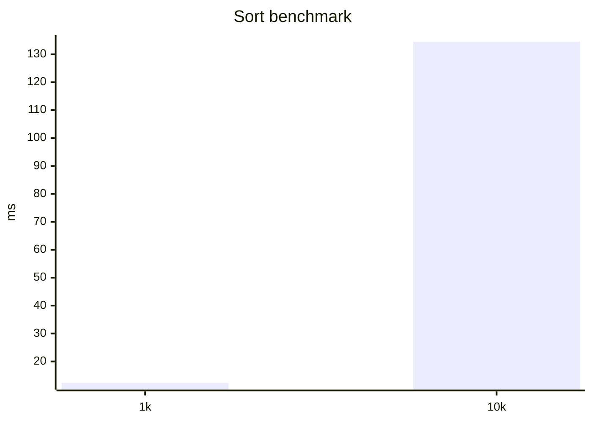

# Skills — Usage Guide

**Skills** are reusable workflow prompt templates you write once and trigger
with `/<name>` later. Common uses: code-review checklists, PR-review
playbooks, language- or framework-specific best-practice cheatsheets.

中文版：[skills.md](./skills.md)

---

## TL;DR

```bash
# A user-scope skill (available in every project)
mkdir -p ~/.x-code/skills/code-review
cat > ~/.x-code/skills/code-review/SKILL.md <<'EOF'
---
name: code-review
description: Review a diff against the team checklist
---
Review the diff I provide using these criteria:
1. Boundary conditions covered
2. Error handling complete
3. Tests updated to match
4. New dependencies introduced
EOF

# Restart xc, or `/skill refresh` in the running session.
# Then in chat:
> /code-review @D:\project\diff.patch
```

---

## What a skill looks like on disk

A skill is a directory with a `SKILL.md` at the top:

```
~/.x-code/skills/<name>/
├── SKILL.md           # required: YAML frontmatter + Markdown body
├── references/        # optional bundled resources
├── scripts/           # optional helper scripts
└── ...                # any other files
```

**SKILL.md content**:

```markdown
---
name: code-review
description: Review a diff against the team checklist (the agent reads this to decide whether to activate)
---

Review the diff I provide using these criteria:
...
```

The frontmatter accepts exactly two fields:

- `name` (required) — should match the directory name; `/<name>` triggers it
- `description` (required) — one-line summary; the agent reads it to decide
  when to activate the skill on its own

**Bundled files**: at activation time the CLI lists every non-hidden file in
the skill directory (capped at 50) and hands the list to the agent, which
can then read any of them by relative path:

```markdown
Walk through the checklist in references/checklist.md and apply each item.
```

---

## Where skills live

| Scope   | Path                                    | When                                     |
| ------- | --------------------------------------- | ---------------------------------------- |
| User    | `~/.x-code/skills/<name>/SKILL.md`      | Personal workflows that apply everywhere |
| Project | `<repo>/.x-code/skills/<name>/SKILL.md` | Workflows for one repo only              |

A project-level skill overrides a user-scope skill of the same name. `.x-code/`
at the repo root is gitignored — to share skills with a team, publish them
as a plugin (see [plugins.en.md](./plugins.en.md)).

> **Windows paths**: `~/.x-code` maps to `%USERPROFILE%\.x-code` on Windows.
> Not repeated below.

---

## How activation works

**Both activation paths inject the same `<activated_skill>` payload**:

### 1. The user types `/<name>`

```text
> /code-review
(agent receives the skill body and starts following it)

> /code-review @src/utils.ts
(same, plus src/utils.ts is attached in the same turn)
```

### 2. The agent calls `activateSkill` on its own

When a skill's `description` matches the current task, the agent may
activate it without prompting. That's why writing a precise description
matters:

```markdown
---
name: react-hooks
description: Check React Hook calls against the rules-of-hooks
---
```

Too vague (e.g. "for React") triggers false activations; too narrow
(e.g. "check missing refs in useEffect dependency arrays") never auto-
activates. One clear sentence about _when_ to use it works best.

---

## `/skill` commands

| Command                                         | Description                                                               |
| ----------------------------------------------- | ------------------------------------------------------------------------- |
| `/skill list`                                   | List all loaded skills with on/off state and source (user / project)      |
| `/skill install <url>`                          | Download a SKILL.md from a URL into user scope (plain HTTP fetch, no git) |
| `/skill refresh`                                | Re-scan skill directories + settings; takes effect immediately            |
| `/skill enable <name> [--scope=user\|project]`  | Re-enable a disabled skill                                                |
| `/skill disable <name> [--scope=user\|project]` | Disable a skill (file kept; effective after `/skill refresh`, or restart) |
| `/skill uninstall <name>`                       | Delete the skill directory (rejected for plugin-sourced skills)           |

Disabled state is persisted to the matching scope's settings:

- user → `disabledSkills` array in `~/.x-code/settings.json`
- project → `disabledSkills` array in `<cwd>/.x-code/settings.local.json`

The two lists are unioned — disabled in either scope means disabled.

---

## Worked examples

### Example 1: PR-review playbook (team checklist)

`~/.x-code/skills/pr-review/SKILL.md`:

```markdown
---
name: pr-review
description: Walk a PR diff through the team review checklist and return GO/NOGO
---

For the PR diff I provide, check in order and produce a Markdown report:

## Must-pass (any fail → NOGO)

1. Tests included, covering the main path
2. No breaking changes to public surface (package exports / routes / DB schema)
3. Any new dependency present on the allowlist

## Should-check (flag but don't block)

4. Naming follows existing conventions
5. Docs / comments updated

See references/api-allowlist.md for the allowed dependency list.

End with: **GO** or **NOGO + blocking reason**.
```

`~/.x-code/skills/pr-review/references/api-allowlist.md`:

```markdown
# Approved dependencies

- axios
- zod
- date-fns
  (anything else requires approval)
```

Usage:

```text
> /pr-review here is the diff @D:\code\repo\diff.patch
```

### Example 2: Turn benchmark text into a chart

`~/.x-code/skills/perf-chart/SKILL.md`:

````markdown
---
name: perf-chart
description: Render plain-text benchmark output as a mermaid xychart
---

I'll give you benchmark text (one operation per line). Please:

1. Extract operation name / mean / stddev from each line
2. Emit a mermaid xychart-beta block
3. No prose — just the ```mermaid block

Example input:
sort 1000 items: 12.3ms ± 1.1
sort 10000 items: 134.5ms ± 4.2

Output:


````

---

## Relationship to plugins

Plugins can bundle skills: a plugin manifest declares `"skills": "./skills"`
and each subdir under that path becomes a skill. They load identically to
hand-authored user-scope skills, but carry a `pluginId` tag.

`/skill uninstall` won't delete a plugin-sourced skill — it redirects to
`/plugin uninstall` for the owning plugin.

See [plugins.en.md](./plugins.en.md) and [plugin-authoring.en.md](./plugin-authoring.en.md).

---

## Troubleshooting

| Symptom                                       | Fix                                                                    |
| --------------------------------------------- | ---------------------------------------------------------------------- |
| Edited SKILL.md but nothing changed           | `/skill refresh` or restart `xc`                                       |
| `/<name>` says skill not found                | `/skill list` to confirm load; check frontmatter validity              |
| Want to disable temporarily without removing  | `/skill disable <name>`                                                |
| Agent keeps activating it incorrectly         | Tighten the `description` — avoid broad words like "code" or "project" |
| Bundled file list got truncated (>50 entries) | Split into multiple skills                                             |

```

```
