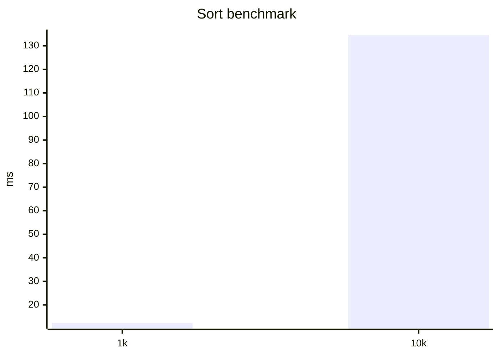

# Skills — 使用指南

**Skills** 是你写一次、之后用 `/<name>` 一键触发的工作流提示词模板。常见用途：代码审查清单、PR 评审范式、特定语言/框架的最佳实践规范。

英文版：[skills.en.md](./skills.en.md)

---

## TL;DR

```bash
# 用户级 skill（所有项目可用）
mkdir -p ~/.x-code/skills/code-review
cat > ~/.x-code/skills/code-review/SKILL.md <<'EOF'
---
name: code-review
description: 按公司清单审查改动
---
请按下列要点审查我提供的 diff：
1. 边界条件是否覆盖
2. 错误处理是否完整
3. 单测是否同步更新
4. 是否引入新的依赖
EOF

# 重启 xc 或在交互中 /skill refresh
# 然后在对话里：
> /code-review @D:\project\diff.patch
```

---

## Skill 文件长什么样

一个 skill 就是一个目录，里面有一个 `SKILL.md`：

```
~/.x-code/skills/<name>/
├── SKILL.md           # 必需，YAML frontmatter + Markdown body
├── references/        # 可选，bundled 资源
├── scripts/           # 可选，可执行脚本
└── ...                # 任意附加文件
```

**SKILL.md 内容**：

```markdown
---
name: code-review
description: 按公司清单审查改动（被 agent 拿来判断是否激活时阅读）
---

请按下列要点审查我提供的 diff：
...
```

frontmatter 只接受两个字段：

- `name`（必需）：与目录名一致；激活命令就是 `/<name>`
- `description`（必需）：一句话描述，agent 会读它来决定是否在合适场景主动激活

**bundled 文件**：激活时，CLI 自动列出 `SKILL.md` 同级及子目录的所有文件（限 50 个）给 agent 看，agent 可以按相对路径读它们：

```markdown
请按 references/checklist.md 中列的要点审查
```

---

## Skills 存放位置

| Scope | 路径                                    | 何时用               |
| ----- | --------------------------------------- | -------------------- |
| 用户  | `~/.x-code/skills/<name>/SKILL.md`      | 个人通用工作流       |
| 项目  | `<repo>/.x-code/skills/<name>/SKILL.md` | 仅此项目使用的工作流 |

项目级同名 skill 会覆盖用户级同名。`.x-code/` 在仓库根是 gitignored 的，团队共享 skill 需要换约定或者发布成 plugin（见 [plugins.md](./plugins.md)）。

> **Windows 路径**：`~/.x-code` 在 Windows 上是 `%USERPROFILE%\.x-code`，下文不再重复。

---

## 怎么触发

**两种方式都会注入完全相同的 `<activated_skill>` 内容**：

### 1. 用户主动 `/<name>` 命令

```text
> /code-review
（agent 收到 skill body，开始按提示词工作）

> /code-review @src/utils.ts
（同上，但额外把 src/utils.ts 一并发给 agent）
```

### 2. Agent 自主调用 `activateSkill` 工具

当 system prompt 里列出的 skill 描述与当前任务相关时，agent 可能主动激活——这是为什么 `description` 写得好很重要：

```markdown
---
name: react-hooks
description: 用于检查 React Hook 调用是否符合 rules-of-hooks
---
```

写得不清楚（如"用于 React"）容易导致 agent 错误激活；写得太具体（如"用于检查 useEffect 依赖数组里有没有遗漏 ref"）则永远不会被自动激活。一句明确的"什么场景该用"是最佳形态。

---

## `/skill` 命令族

| 命令                                            | 说明                                                                 |
| ----------------------------------------------- | -------------------------------------------------------------------- |
| `/skill list`                                   | 列出所有已加载 skill，含 on/off 状态 + 来源（user / project）        |
| `/skill install <url>`                          | 从 URL 下载一个 SKILL.md 装到用户级（直接 HTTP fetch，无 git）       |
| `/skill refresh`                                | 重扫 skill 目录 + 设置文件，立即生效                                 |
| `/skill enable <name> [--scope=user\|project]`  | 启用一个被禁用的 skill                                               |
| `/skill disable <name> [--scope=user\|project]` | 禁用一个 skill（保留文件，跑 `/skill refresh` 立即生效，或下次启动） |
| `/skill uninstall <name>`                       | 删除 skill 目录（仅对非 plugin 来源的 skill 生效）                   |

启用状态写到对应 scope 的 settings：

- user → `~/.x-code/settings.json` 的 `disabledSkills` 数组
- project → `<cwd>/.x-code/settings.local.json` 的 `disabledSkills` 数组

两个列表取并集——任一 scope 禁用则禁用。

---

## 实战示例

### 例 1：PR 评审范式（公司内部清单）

`~/.x-code/skills/pr-review/SKILL.md`：

```markdown
---
name: pr-review
description: 按公司 PR 评审清单逐项检查并给出 GO/NOGO
---

针对我提供的 PR 改动，按下列顺序检查并输出 markdown 报告：

## 必查项（任一不通过 → NOGO）

1. 是否带单测，覆盖了主路径
2. 是否破坏现有公开 API（package.json exports / 路由 / DB schema）
3. 是否引入新依赖；如有，新依赖是否在公司允许列表

## 建议项（标记但不阻断）

4. 命名是否符合现有惯例
5. 注释/文档是否同步

参考 references/api-allowlist.md 看允许的依赖清单。

最后给一个总评：**GO** 或 **NOGO + 阻塞原因**。
```

`~/.x-code/skills/pr-review/references/api-allowlist.md`：

```markdown
# 允许的依赖列表

- axios
- zod
- date-fns
  （其他需走审批）
```

使用：

```text
> /pr-review 这是改动 @D:\code\repo\diff.patch
```

### 例 2：把命令行输出转成图表

`~/.x-code/skills/perf-chart/SKILL.md`：

````markdown
---
name: perf-chart
description: 把基准测试的纯文本输出渲染成 mermaid 图
---

我会给你一段基准测试输出（数字 + 操作名）。请：

1. 抽取每行的"操作名 / 平均耗时 / 标准差"
2. 输出一个 mermaid xychart-beta 图
3. 不要附加解释——只要 ```mermaid 代码块

例如输入：
sort 1000 items: 12.3ms ± 1.1
sort 10000 items: 134.5ms ± 4.2

输出：


````

---

## 与 plugin 的关系

Plugin 可以把 skills 打包发布：plugin 的 manifest 声明 `"skills": "./skills"`，里面的每个子目录就是一个 skill，加载方式与你手写的用户级 skill 完全一致，只是会带上 `pluginId` 标记。

`/skill uninstall` 不能删 plugin skill——会提示你用 `/plugin uninstall` 卸载整个 plugin。

详情见 [plugins.md](./plugins.md) 与 [plugin-authoring.md](./plugin-authoring.md)。

---

## 常见问题

| 问题                       | 处理                                                    |
| -------------------------- | ------------------------------------------------------- |
| 改了 SKILL.md 不生效       | `/skill refresh` 或重启 `xc`                            |
| `/<name>` 提示找不到 skill | `/skill list` 确认是否加载；frontmatter 是否合法        |
| 想临时禁用而不删除         | `/skill disable <name>`                                 |
| Agent 总是错误自动激活     | 把 `description` 写得更具体——避开宽泛词如"代码"、"项目" |
| Bundled 文件太大（>50）    | 列表会被截断；考虑拆成多个 skill                        |

```

```
